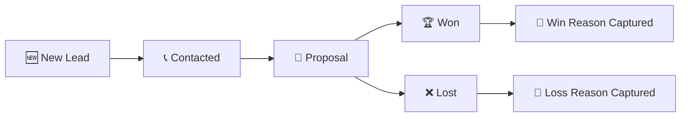

# 💼 LeadFlow ERP (Enterprise CRM & Pipeline Management System)

> **Live Production Deployment:** Deployed on **Vercel** 🚀

**LeadFlow ERP** is a lightweight CRM application built with **Next.js 16 (App Router)**, **React 19**, **TypeScript**, and **Tailwind CSS v4** for managing leads, tracking deal progress, and monitoring sales pipeline activity from a single interface.

---

## 🌟 Features

* **Kanban Deal Board** — Manage deals across five stages: New Lead, Contacted, Proposal, Won, and Lost, with drag-and-drop stage updates.
* **Lead Management** — View and edit lead details through a dedicated drawer, with support for recording calls, emails, meetings, and notes.
* **Win/Loss Tracking** — Capture the reason behind closed deals, such as pricing, feature fit, or competitor selection.
* **Pipeline Analytics** — Track active pipeline value, deal counts, won/lost totals, and stage-wise distribution.
* **Multi-Currency Support** — View and convert deal values across INR, USD, and EUR.
* **Activity & Notifications** — Track lead creation, deal movements, and other pipeline activities through a centralized activity stream.
* **Theme & Layout Customization** — Supports dark/light mode, multiple accent themes, and compact/cozy display density.
* **Data Persistence** — Stores application data locally using browser LocalStorage, with an option to reset the application to its initial demo state.

---

## 🔄 Deal Pipeline & Workflow

`New Lead → Contacted → Proposal → Won / Lost`

### 1. Lead Lifecycle Workflow


1. **Lead Generation & Ingestion**: Leads are created via the top navbar action or loaded from storage. Initial status defaults to `New Lead`.
2. **Engagement & Transition**: Drag and drop cards across pipeline columns or switch stages inside the Lead Detail drawer.
3. **Closure Feedback Loop**: Moving a lead to `Won` or `Lost` opens an automated reason feedback dialog.
4. **Audit Trail**: Every stage movement generates an entry in the lead's Activity Timeline and posts a notification to the Alert Center.

### 2. Module Structure

- **Deals View**: Interactive drag-and-drop Kanban board with stage totals and card summaries.
- **Leads View**: Clean table list view for quick filtering and search queries across company, contact, or email.
- **Feeds View**: Chronological activity feed of pipeline events.
- **Home View**: Executive dashboard overview displaying high-level metrics.

---

## 🛠️ Technology Stack

| Category | Technology |
|---|---|
| **Framework** | [Next.js 16](https://nextjs.org/) (App Router) |
| **UI Core** | [React 19](https://react.dev/) |
| **Language** | [TypeScript](https://www.typescriptlang.org/) |
| **Styling** | [Tailwind CSS v4](https://tailwindcss.com/) |
| **State & Storage** | React `useState` & `useMemo` with `localStorage` persistence |
| **Hosting & Deployment** | [Vercel](https://vercel.com/) |

---

## 🚀 Deployment & Build Verification

This project is deployed live on **Vercel**. Continuous integration automatically deploys updates pushed to the repository.

### Build & Lint Commands

```bash
# Production Build Validation
npm run build

# Code Linting
npm run lint
```

---

## 📂 Directory Structure

```
leadflow-mini/
├── app/
│   ├── favicon.ico
│   ├── globals.css         # Global styling & Tailwind directives
│   ├── layout.tsx          # Root layout & font configurations
│   └── page.tsx            # Main CRM Dashboard Shell & Pipeline components
├── public/                 # Static assets
├── next.config.ts          # Next.js configuration
├── package.json            # Project dependencies & scripts
└── tsconfig.json           # TypeScript configuration
```
